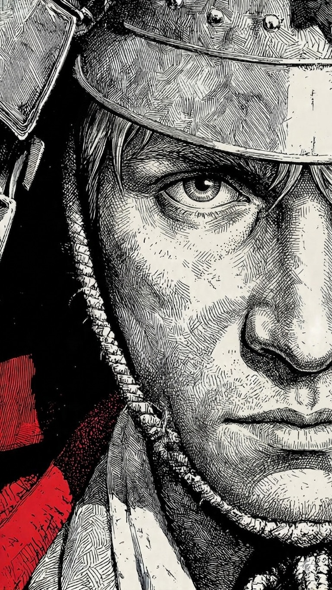
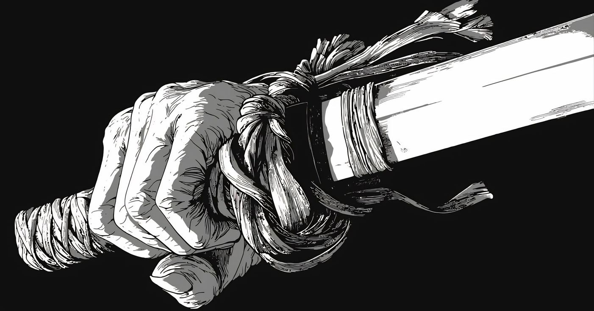

  

<table>
<tr>
<td width="55%" valign="top">

  

</td>
<td width="60%" valign="top">
 <h1>Khabirakhmanov Karim</h1>

### About

Applied AI student (Innopolis University, GPA 4.89).
Build ML systems and LLM-based pipelines end-to-end.

---

### Experience

- Build ML pipelines: parsing → features → modeling → inference  
- Develop LLM systems: agents, tool-calling, RAG  
- Design distributed services (API, workers, queues)  
- Train and fine-tune models (CatBoost, CNN, LoRA / QLoRA)  
- Prepare datasets and evaluation pipelines.

### Tech Stack

  

### Achievements

- ML Intern — Yandex  
- 1st place — T-Bank Code & Sport (2026)  
- Hackathon participant — Telegram Ads Forecasting  

</td>
</tr>

</table>

